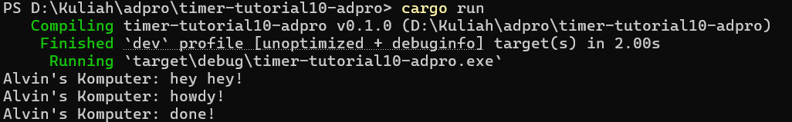

Pesan muncul dengan urutan "hey hey!" terlebih dahulu, lalu "howdy!" dan "done!" karena cara kerja pemrograman asinkron dalam kode ini. Ketika ```spawner.spawn(async)``` dipanggil, blok async tidak langsung dieksekusi, melainkan hanya menambahkan tugas ke dalam antrian untuk dijalankan nanti. Sementara itu, baris ```println!("Alvin's Komputer: hey hey!");``` langsung dijalankan di thread utama, sebelum tugas asinkron manapun dimulai. Baru setelah itu, ketika ```executor.run();``` dipanggil, executor mulai memproses tugas-tugas dalam antrian, termasuk blok async tersebut.